<!DOCTYPE html>
<html lang="english">
  <head>
    <title>exported project</title>
    <meta name="viewport" content="width=device-width, initial-scale=1.0" />
    <meta charset="utf-8" />
    <meta property="twitter:card" content="summary_large_image" />
    
    
    <link
      rel="stylesheet"
      href="https://unpkg.com/animate.css@4.1.1/animate.css"
    />
    <link
      rel="stylesheet"
      href="https://fonts.googleapis.com/css2?family=Poppins:ital,wght@0,100;0,200;0,300;0,400;0,500;0,600;0,700;0,800;0,900;1,100;1,200;1,300;1,400;1,500;1,600;1
      data-tag="font"
    />
    <link
      rel="stylesheet"
      href="https://fonts.googleapis.com/css2?family=Poppins:ital,wght@0,100;0,200;0,300;0,400;0,500;0,600;0,700;0,800;0,900;1,100;1,200;1,300;1,400;1,500;1,600;1
      data-tag="font"
    />
    <link
      rel="stylesheet"
      href="https://fonts.googleapis.com/css2?family=Poppins:ital,wght@0,100;0,200;0,300;0,400;0,500;0,600;0,700;0,800;0,900;1,100;1,200;1,300;1,400;1,500;1,600;1
      data-tag="font"
    />
    <link
      rel="stylesheet"
      href="https://fonts.googleapis.com/css2?family=Poppins:ital,wght@0,100;0,200;0,300;0,400;0,500;0,600;0,700;0,800;0,900;1,100;1,200;1,300;1,400;1,500;1,600;1
      data-tag="font"
    />
    <link
      rel="stylesheet"
      href="https://fonts.googleapis.com/css2?family=Poppins:ital,wght@0,100;0,200;0,300;0,400;0,500;0,600;0,700;0,800;0,900;1,100;1,200;1,300;1,400;1,500;1,600;1
      data-tag="font"
    />
    <link
      rel="stylesheet"
      href="https://fonts.googleapis.com/css2?family=Poppins:ital,wght@0,100;0,200;0,300;0,400;0,500;0,600;0,700;0,800;0,900;1,100;1,200;1,300;1,400;1,500;1,600;1
      data-tag="font"
    />
    <link
      rel="stylesheet"
      href="https://fonts.googleapis.com/css2?family=Poppins:ital,wght@0,100;0,200;0,300;0,400;0,500;0,600;0,700;0,800;0,900;1,100;1,200;1,300;1,400;1,500;1,600;1
      data-tag="font"
    />
    <link
      rel="stylesheet"
      href="https://fonts.googleapis.com/css2?family=Inter:wght@100;200;300;400;500;600;700;800;900&amp;display=swap"
      data-tag="font"
    />
    <link
      rel="stylesheet"
      href="https://fonts.googleapis.com/css2?family=Poppins:ital,wght@0,100;0,200;0,300;0,400;0,500;0,600;0,700;0,800;0,900;1,100;1,200;1,300;1,400;1,500;1,600;1
      data-tag="font"
    />
    <link
      rel="stylesheet"
      href="https://fonts.googleapis.com/css2?family=Poppins:ital,wght@0,100;0,200;0,300;0,400;0,500;0,600;0,700;0,800;0,900;1,100;1,200;1,300;1,400;1,500;1,600;1
      data-tag="font"
    />
    <link
      rel="stylesheet"
      href="https://fonts.googleapis.com/css2?family=Poppins:ital,wght@0,100;0,200;0,300;0,400;0,500;0,600;0,700;0,800;0,900;1,100;1,200;1,300;1,400;1,500;1,600;1
      data-tag="font"
    />
    <link
      rel="stylesheet"
      href="https://fonts.googleapis.com/css2?family=Inter:wght@100;200;300;400;500;600;700;800;900&amp;display=swap"
      data-tag="font"
    />
    <link
      rel="stylesheet"
      href="https://fonts.googleapis.com/css2?family=Poppins:ital,wght@0,100;0,200;0,300;0,400;0,500;0,600;0,700;0,800;0,900;1,100;1,200;1,300;1,400;1,500;1,600;1
      data-tag="font"
    />
    <link
      rel="stylesheet"
      href="https://fonts.googleapis.com/css2?family=Poppins:ital,wght@0,100;0,200;0,300;0,400;0,500;0,600;0,700;0,800;0,900;1,100;1,200;1,300;1,400;1,500;1,600;1
      data-tag="font"
    />
    <link
      rel="stylesheet"
      href="https://fonts.googleapis.com/css2?family=Poppins:ital,wght@0,100;0,200;0,300;0,400;0,500;0,600;0,700;0,800;0,900;1,100;1,200;1,300;1,400;1,500;1,600;1
      data-tag="font"
    />
    <link
      rel="stylesheet"
      href="https://fonts.googleapis.com/css2?family=Inter:wght@100;200;300;400;500;600;700;800;900&amp;display=swap"
      data-tag="font"
    />
    <link
      rel="stylesheet"
      href="https://fonts.googleapis.com/css2?family=Poppins:ital,wght@0,100;0,200;0,300;0,400;0,500;0,600;0,700;0,800;0,900;1,100;1,200;1,300;1,400;1,500;1,600;1
      data-tag="font"
    />
    <link
      rel="stylesheet"
      href="https://unpkg.com/@teleporthq/teleport-custom-scripts/dist/style.css"
    />
  </head>
  <body>
    <link rel="stylesheet" href="./style.css" />
    

      <link href="./index.css" rel="stylesheet" />

        

          

            
              
                Classic UI: Less Interaction
              
               
               
              
                Listen to your music, to your heart's content.
              
               
               
            
            
              Get Your App On Amazon AppStore
            
            <a
              href="https://www.amazon.com/dp/B0CV1DCSD9/ref=apps_sf_sta"
              target="_blank"
              rel="noreferrer noopener"
              class="finalisedpanel-link"
            >
              

                
                
                
                  amazon.BlissMusic
                
              

            </a>
          

          

            
            License:
            
              is&nbsp;
              Free Software
              
                : You can use, study, share and modify it at your will. The app
                can be redistributed and/or modified under the terms of
                the&nbsp;
              
              
                GNU General Public License version 3 or later
              
              
                &nbsp;published by the&nbsp;
              
              
                Free Software Foundation.
              
            
          

          

            

              

                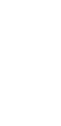
                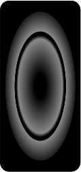
                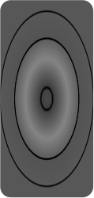
                
                

                  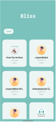
                

                

                  
                  
                  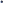
                  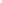
                

                

                  
                  
                  
                  
                

              

              

                
                
              

            

            ScreenShots:
            

              

                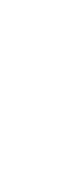
                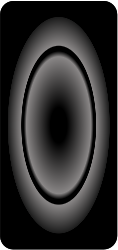
                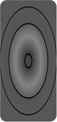
                
                

                  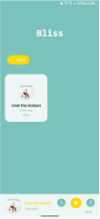
                

                

                  
                  
                  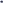
                  
                

                

                  
                  
                  
                  
                

              

              

                
                
              

            

            

              

                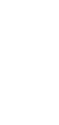
                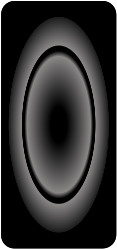
                
                
                

                  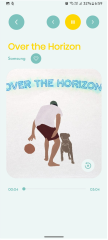
                

                

                  
                  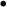
                  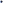
                  
                

                

                  
                  
                  
                  
                

              

              

                
                
              

            

            
              Listen To Your Fav Songs Without Any
               
              Subscription.
            
          

          

            
              
                Bliss Music Player is a free and easy-to-use app that lets you
                play your local music or audio files on your device. Whether you
                want to listen to your favorite songs, podcasts, audiobooks, or
                any other audio content, Bliss Music Player has you covered.
                With Bliss Music Player, you can: play your Local music. Save
                your favorite songs and access them in the liked tab. Use the
                repeat and shuffle modes to customize your playback order.
                Control your music with simple gestures ,widgets on your lock
                screen. Support multiple music formats such as MP3, WAV, FLAC,
                AAC, OGG, and more. Share your music with your friends and
                family via social media, email, or Bluetooth. Bliss Music Player
                is the ultimate music app for your device. Download it today and
                enjoy your music in bliss. 😊
              
            
            About:
          

          

            

              Features:
              
                
                  1.The Bliss Music app interface has a teal color scheme with
                  white text and yellow accents, giving it a modern and
                  minimalist aesthetic.
                
                 
                 
                
                  2.The app supports multiple music formats, such as MP3, WAV,
                  FLAC, AAC, M4a, and more.
                
                 
                 
                
                  3.The app allows users to browse, play, and control their
                  local music library.
                
                 
                 
                
                  4.Play your favorite songs from your local music library
                  without any subscription or internet connection required.
                
                 
                 
                
                  5.The app has a simple and intuitive gesture-based navigation
                  for easy access and control.
                
                 
                 
                
                  6.You can share your favorite songs with your loved ones.
                
                 
                 
                
                  7.The app provides various equalizer and audio effects options
                  to customize the sound quality and enhance the listening
                  experience.
                
              
            

            
          

          

            Bliss Music
            <a
              href="https://www.amazon.com/dp/B0CV1DCSD9/ref=apps_sf_sta"
              target="_blank"
              rel="noreferrer noopener"
              class="finalisedpanel-link2"
            >
              

                
                
                
                  amazon.BlissMusic
                
              

            </a>
            
              
                Do you love listening to music on your device, but hate the
                hassle of syncing, streaming, and downloading? If so, you need
                Bliss Music, the ultimate music player app that lets you play
                your music files on your device. With Bliss Music.
              
            
          

        

      

    

  </body>
</html>

Android Project Coded By- Vedant.R.J.Chourey
